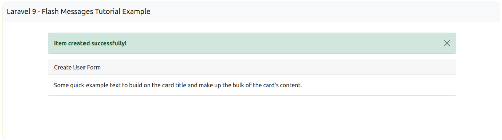
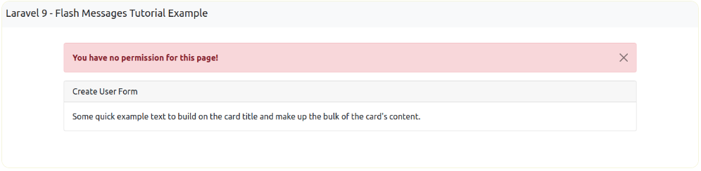
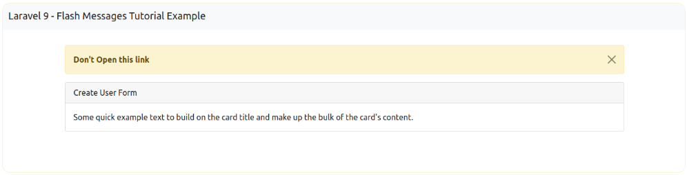
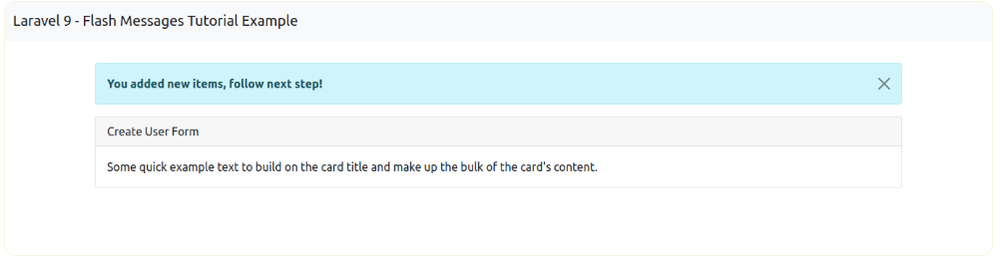
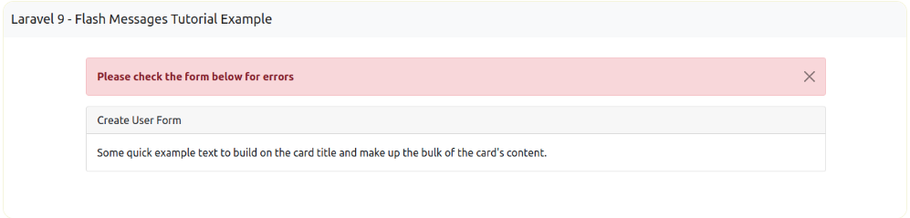

# laravel9_flash_message
## 1: Create Global File For Flash Message
- Tạo file flash-message.blade.php
- success
- error
- warning
- info
- validation error
  + Tạo resources/views/flash-message.blade.php
```Dockerfile
@if ($message = Session::get('success'))
<div class="alert alert-success alert-dismissible fade show" role="alert">
  <strong>{{ $message }}</strong>
  <button type="button" class="btn-close" data-bs-dismiss="alert" aria-label="Close"></button>
</div>
@endif 
    
@if ($message = Session::get('error'))
<div class="alert alert-danger alert-dismissible fade show" role="alert">
  <strong>{{ $message }}</strong>
  <button type="button" class="btn-close" data-bs-dismiss="alert" aria-label="Close"></button>
</div>
@endif
     
@if ($message = Session::get('warning'))
<div class="alert alert-warning alert-dismissible fade show" role="alert">
  <strong>{{ $message }}</strong>
  <button type="button" class="btn-close" data-bs-dismiss="alert" aria-label="Close"></button>
</div>
@endif
     
@if ($message = Session::get('info'))
<div class="alert alert-info alert-dismissible fade show" role="alert">
  <strong>{{ $message }}</strong>
  <button type="button" class="btn-close" data-bs-dismiss="alert" aria-label="Close"></button>
</div>
@endif
    
@if ($errors->any())
<div class="alert alert-danger alert-dismissible fade show" role="alert">
  <strong>Please check the form below for errors</strong>
  <button type="button" class="btn-close" data-bs-dismiss="alert" aria-label="Close"></button>
</div>
@endif
``` 
## 2: Use Flash Message in Theme
-  Chúng ta có thể sử dụng tệp resources/views/flash-message.blade.php trong file bằng cách 
```Dockerfile
@include('flash-message')
```
- hoặc bằng cách như sau Vào resources/views/layouts/app.blade.php
```Dockerfile
<!DOCTYPE html>
<html lang="en">
<head>
    <meta charset="utf-8">
    <meta http-equiv="X-UA-Compatible" content="IE=edge">
    <meta name="viewport" content="width=device-width, initial-scale=1">
    <!-- Styles -->
    <link href="https://cdn.jsdelivr.net/npm/bootstrap@5.0.2/dist/css/bootstrap.min.css" rel="stylesheet">
    <script src="https://cdn.jsdelivr.net/npm/bootstrap@5.0.2/dist/js/bootstrap.bundle.min.js" ></script>
</head>
<body>
  
<div class="container">
  
    @include('flash-message')
  
    @yield('content')
  
</div>
  
    <!-- Scripts -->
    <script src="/js/app.js"></script>
</body>
</html> 
```
## 3: Use Flash Messages with Redirect
## 3.1 : Redirect with success message  
-  Chúng ta có thể chuyển hướng router
```Dockerfile
public function create(Request $request)
{
	$this->validate($request,[
        'title' => 'required',
        'details' => 'required'
        ]);


	$items = Item::create($request->all());


	return back()->with('success','Item created successfully!');
}
```
- Chúng ta có layout success flash message



## 3.2: Redirect with error message
- tôi có thể đơn giản chuyển hướng tuyến đường hoặc chuyển hướng url hoặc chuyển hướng trở lại với thông báo flash lỗi, chúng tôi có thể sử dụng trong bộ điều khiển như cách này:
```Dockerfile
public function create(Request $request)
{
    return redirect()->route('home')
        ->with('error','You have no permission for this page!');
}
```


## 3.3: Redirect with warning message
```Dockerfile
public function create(Request $request)
{
    return redirect()->route('home')
            ->with('warning',"Don't Open this link");
}
```



## 3.4: Redirect with info message
```Dockerfile
public function create(Request $request)
{
    $this->validate($request,[
        'title' => 'required',
        'details' => 'required'
        ]);


    $items = Item::create($request->all());


    return back()->with('info','You added new items, follow next step!');
}
```



## 3.5: Validation Error
```Dockerfile
public function create(Request $request)
{
    $this->validate($request,[
        'title' => 'required',
        'details' => 'required'
        ]);


    .....
}
```


